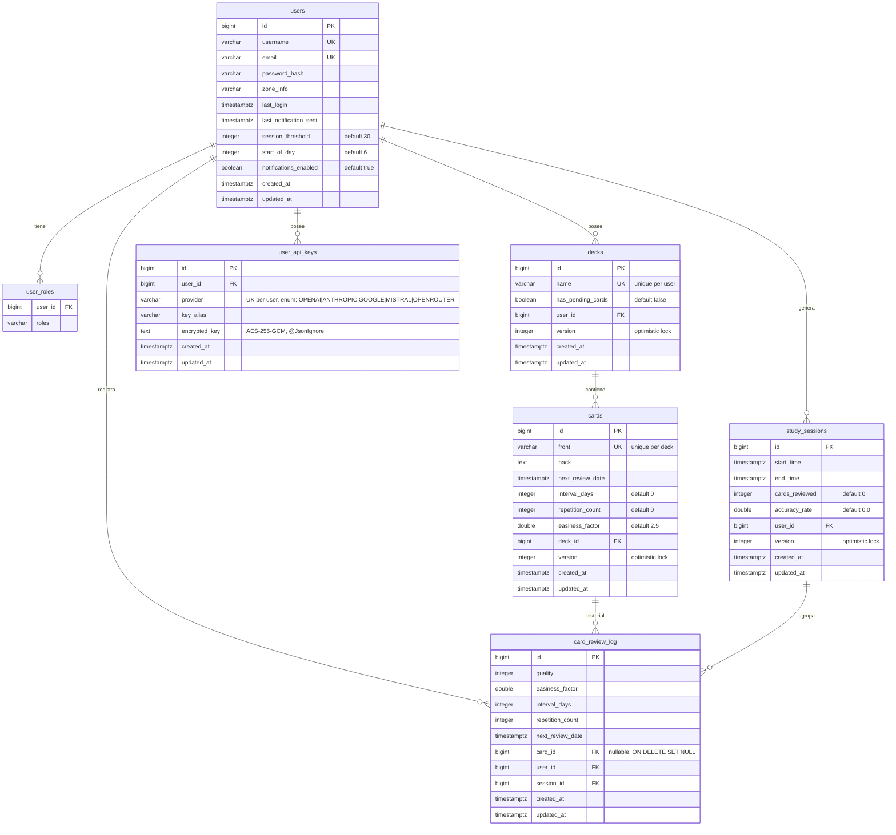

# Software Design Document (SDD): Flashcard Management API

## 1. Metadatos y Control del Documento

* **Proyecto:** Flashcard API
* **Versión:** 0.0.1-SNAPSHOT
* **Estado:** Pre-release
* **Fecha:** Junio de 2026

---

## 2. Overview (Resumen Ejecutivo)

Este documento describe el diseño de la API RESTful para la gestión de flashcards.
Es un backend construido con Spring Boot que permite el estudio a través de un algoritmo
básico de repetición espaciada (SM-2) y la gestión de mazos (decks) con sus respectivas tarjetas
de estudio (flashcards). Facilita el acceso a las sesiones de estudio y envía alertas a los usuarios.

---

## 3. Contexto

Este proyecto nace con la necesidad de proveer una herramienta que mejore el estudio y la retención de información
a través de la repetición espaciada, expuesta mediante una API que pueda ser consumida por múltiples frontends.

---

## 4. Metas y No-Metas (Scope)

### 4.1 Metas (In-Scope)

* Gestionar mazos: leer, crear, modificar y eliminar.
* Gestionar tarjetas de estudio: leer, crear, modificar y eliminar.
* Gestionar revisiones: crear revisiones sobre tarjetas.
* Gestionar sesiones de estudio: leer sesiones agrupadas por tiempo.
* Gestionar estadísticas de estudio: métricas globales del usuario.
* Gestionar notificaciones por email (Maileroo API): el sistema envía notificaciones al usuario cuando tiene
  tarjetas pendientes por responder.
* Gestionar usuarios: leer (solo rol admin), crear, modificar, eliminar.
* Autenticación y autorización: registro y login con cifrado de contraseñas; Spring Security y JWT.
* Seguridad ante ataques: limitación de peticiones (rate limiting), protección ante inyección de código, IDOR, CSRF,
  etc.
* Implementar algoritmo de repetición espaciada SM-2.
* Paginación de resultados por cursor.
* Detectar y actualizar zona horaria.
* Código limpio, escalable y de buena calidad.

### 4.2 No-Metas (Out-of-Scope)

* Interfaz de usuario.
* Consumo en dispositivos móviles.
* Compartir recursos directamente dentro de la aplicación.
* Soporte para cantidades considerables de usuarios (+50).
* Soporte para varios algoritmos de repetición espaciada.
* Asistente IA: análisis de sesiones de estudio (previsto para versiones futuras).

---

## 5. Diseño Arquitectónico (High-Level Design - HLD)

### 5.1 Diagrama de Arquitectura

El sistema sigue una arquitectura clásica por capas (Layered Architecture) en Spring Boot,
separando responsabilidades de presentación, lógica de negocio y persistencia.

```
┌─────────────────────────────────────────────────────┐
│                    API Layer                         │
│   Controladores REST (Auth, User, Deck, Card,       │
│   Review, Session, Admin)                           │
├─────────────────────────────────────────────────────┤
│                  Security Layer                      │
│   RateLimitingFilter → JwtAuthenticationFilter      │
│   Spring Security + Method Security                 │
├─────────────────────────────────────────────────────┤
│                  Service Layer                       │
│   Lógica de negocio, SM-2, notificaciones,          │
│   eventos asíncronos                                │
├─────────────────────────────────────────────────────┤
│               Data Access Layer                      │
│   Spring Data JPA, Specifications, Window/Cursor    │
├─────────────────────────────────────────────────────┤
│               Database (PostgreSQL)                  │
│   Migraciones Flyway (V1-V7)                        │
└─────────────────────────────────────────────────────┘
```

### 5.2 Componentes Principales

* **API Layer:** Controladores REST.
* **Security Layer:** Filtros de seguridad encadenados:
    1. `RateLimitingFilter` (Bucket4j) — limitación de peticiones a `/auth/**`
    2. `JwtAuthenticationFilter` — validación de JWT Bearer token
    3. Spring Security `AuthorizationFilter` — control de acceso por rol
* **Service Layer:** Lógica de negocio y validaciones.
* **Data Access Layer:** Spring Data JPA con paginación por cursor (`Window<T>` + `ScrollPosition`).
* **Management Security:** Los endpoints `/actuator/**` se protegen mediante el SecurityConfig principal
  con JWT Bearer + rol `ADMIN` (mismo mecanismo que el resto de la API). No hay puerto de gestión separado.

### 5.3 Stack Tecnológico

* **Lenguaje:** Java 21.
* **Framework:** Spring Boot 4.1.0.
* **BD:** PostgreSQL 15.
* **Migración:** Flyway.
* **Herramientas:** Maven, Docker.
* **Documentación API:** Springdoc OpenAPI (Swagger UI).
* **Rate Limiting:** Bucket4j 8.10.1.
* **Métricas:** Micrometer + Prometheus.
* **Templates:** Thymeleaf (emails HTML).
* **Email:** Maileroo REST API (maileroo-java-sdk 1.0.0) + Spring Retry 2.0.13.
* **IA:** 5 proveedores (OpenAI, Anthropic, Google, Mistral, OpenRouter) vía REST directo.
* **Tests:** JUnit 5 (Jupiter), Mockito, TestContainers, MockMvcTester.

### 5.4 Seguridad de Actuator

Todos los perfiles (`dev`, `prod`) comparten el mismo puerto para API y Actuator.
La seguridad de Actuator se maneja desde el `SecurityConfig` principal con JWT Bearer token + rol `ADMIN`:

| Propiedad     | Todos los perfiles                      |
|---------------|-----------------------------------------|
| Puerto        | 8080 (mismo que API)                    |
| Autenticación | JWT Bearer token (reusa auth de la API) |
| Rol           | `ADMIN`                                 |

**Reglas de acceso:**

- `/actuator/health`, `/actuator/health/**` → `permitAll()`
- `/actuator/**` → requiere rol `ADMIN` vía JWT Bearer token
- CSRF deshabilitado

> El proyecto incluye `ManagementSecurityConfig` con `@ConditionalOnManagementPort(DIFFERENT)`
> para un escenario con puerto de gestión separado, pero ningún perfil activo define
> `management.server.port` distinto al de la API, por lo que este filtro nunca se activa.

---

## 6. Diseño Detallado (Low-Level Design - LLD)

### 6.1 Modelo de Datos (ERD)

#### Diagrama Entidad-Relación



#### Acciones Referenciales (Foreign Keys)

| FK                                               | Parent → Child                    | ON DELETE |
|--------------------------------------------------|-----------------------------------|-----------|
| `user_roles.user_id → users.id`                  | CASCADE                           |
| `decks.user_id → users.id`                       | CASCADE                           |
| `cards.deck_id → decks.id`                       | CASCADE                           |
| `study_sessions.user_id → users.id`              | CASCADE                           |
| `card_review_log.card_id → cards.id`             | **SET NULL** (preserva histórico) |
| `card_review_log.user_id → users.id`             | CASCADE                           |
| `card_review_log.session_id → study_sessions.id` | CASCADE                           |
| `user_api_keys.user_id → users.id`               | CASCADE                           |

#### Migraciones Flyway

| Migración                        | Contenido                                                                                                                                                                    |
|----------------------------------|------------------------------------------------------------------------------------------------------------------------------------------------------------------------------|
| `V1__initial_schema.sql`         | Creación de tablas, FK, índices básicos, índice parcial `idx_users_notifications_enabled`                                                                                    |
| `V2__add_unique_constraints.sql` | Índices únicos con `LOWER()` para búsquedas case-insensitive en `username`, `email`, `decks.name`, `cards.front`                                                             |
| `V3__add_indexes.sql`            | Índices compuestos para notificaciones (`zone_info + last_notification_sent`) y repaso (`deck_id + next_review_date`)                                                        |
| `V4__add_pagination_indexes.sql` | Índices de paginación por cursor con orden ASC/DESC para cards, decks y sessions                                                                                             |
| `V5__admin_creation.sql`         | Creación del usuario administrador inicial con placeholders `${ADMIN_USERNAME}`, `${ADMIN_EMAIL}`, `${ADMIN_PSW_HASH}`, `${ADMIN_ZONE}`                                      |
| `V6__seed_test_user.sql`         | Seed de datos de prueba — crea `test_user` con 7 decks, 83 tarjetas de vocabulario español-inglés, 5 sesiones completas y 72 registros de review con calidades variadas SM-2 |
| `V7__enable_rls_on_tables.sql`   | Habilita Row-Level Security y políticas permisivas en todas las tablas para compatibilidad con Supabase                                                                      |
| `V8__user_api_keys.sql`          | Crea tabla `user_api_keys` con FK a `users`, restricción única `(user_id, provider)` e índice                                                                                |

#### Auditoría (BaseEntity)

Todas las entidades heredan de `BaseEntity`, que usa `@CreatedDate` / `@LastModifiedDate` de JPA
habilitado via `@EnableJpaAuditing` en `AuditConfig`.

### 6.2 Definición de API (Endpoints)

#### A. Autenticación (`/auth`)

| Método | Endpoint                | Acceso           | Descripción                                                                                |
|--------|-------------------------|------------------|--------------------------------------------------------------------------------------------|
| POST   | `/auth/signup`          | Público          | Inicia registro: valida datos, envía email de verificación. No crea cuenta. (202)          |
| GET    | `/auth/confirm`         | Público          | Muestra página con botón "Confirm Email" (Thymeleaf).                                      |
| POST   | `/auth/confirm`         | Público          | Valida token JWT, crea el usuario en BD, muestra página de éxito (Thymeleaf).              |
| POST   | `/auth/login`           | Público          | Autentica credenciales y devuelve Access Token. Refresh Token se envía en cookie HttpOnly. |
| POST   | `/auth/refresh-token`   | Público (Cookie) | Renueva el Access Token usando el Refresh Token.                                           |
| POST   | `/auth/logout`          | Público          | Borra la cookie refresh_token (sin estado en servidor).                                    |
| POST   | `/auth/forgot-password` | Público          | Envía email de recuperación si la cuenta existe. Siempre 202 para evitar enumeración.      |
| POST   | `/auth/reset-password`  | Público          | Valida token JWT y actualiza la contraseña. Token con hash validation.                     |

#### B. Perfil de Usuario (`/users`)

| Método | Endpoint    | Acceso        | Descripción                                                |
|--------|-------------|---------------|------------------------------------------------------------|
| GET    | `/users/me` | Authenticated | Obtiene la información del perfil del usuario autenticado. |
| PATCH  | `/users/me` | Authenticated | Actualización parcial de los datos del usuario.            |
| DELETE | `/users/me` | Authenticated | Eliminación (Account deletion) del usuario autenticado.    |

#### B2. API Keys de Usuario (`/users/me/api-keys`) — Authenticated

| Método | Endpoint                     | Acceso        | Descripción                                                        |
|--------|------------------------------|---------------|--------------------------------------------------------------------|
| GET    | `/users/me/api-keys`         | Authenticated | Lista las API keys del usuario (valores nunca expuestos).          |
| POST   | `/users/me/api-keys`         | Authenticated | Crea una API key cifrada para un proveedor IA. `409` si ya existe. |
| DELETE | `/users/me/api-keys/{keyId}` | Authenticated | Elimina una API key propia.                                        |

#### C. Gestión de Mazos (`/decks`)

| Método | Endpoint          | Acceso        | Descripción                                                   |
|--------|-------------------|---------------|---------------------------------------------------------------|
| POST   | `/decks`          | Authenticated | Crea un nuevo mazo de flashcards.                             |
| POST   | `/decks/ai`       | Authenticated | Genera un mazo + tarjetas desde archivo .txt/.pdf usando IA.  |
| POST   | `/decks/ai/topic` | Authenticated | Genera un mazo + tarjetas desde un prompt temático usando IA. |
| GET    | `/decks`          | Authenticated | Lista todos los mazos del usuario (Paginado).                 |
| GET    | `/decks/due`      | Authenticated | Lista mazos con tarjetas pendientes de repaso.                |
| PATCH  | `/decks/{deckId}` | Authenticated | Modifica metadatos de un mazo específico.                     |
| DELETE | `/decks/{deckId}` | Authenticated | Elimina un mazo y todas sus tarjetas asociadas.               |

#### D. Gestión de Flashcards (`/cards`)

| Método | Endpoint                       | Acceso        | Descripción                                                   |
|--------|--------------------------------|---------------|---------------------------------------------------------------|
| POST   | `/cards/deck/{deckId}`         | Authenticated | Crea una tarjeta dentro de un mazo específico.                |
| POST   | `/cards/ai/deck/{deckId}`      | Authenticated | Genera tarjetas en un mazo existente desde archivo usando IA. |
| GET    | `/cards/deck/{deckId}`         | Authenticated | Obtiene todas las tarjetas de un mazo (Paginado).             |
| GET    | `/cards/deck/{deckId}/pending` | Authenticated | Obtiene tarjetas que necesitan revisión hoy.                  |
| GET    | `/cards/{cardId}`              | Authenticated | Obtiene el detalle de una tarjeta específica.                 |
| PATCH  | `/cards/{cardId}`              | Authenticated | Actualiza el contenido (frente/dorso) de la tarjeta.          |
| DELETE | `/cards/{cardId}`              | Authenticated | Elimina una tarjeta individual.                               |

#### E. Repaso y Sesiones (`/reviews`, `/sessions`)

| Método | Endpoint                 | Acceso        | Descripción                                                |
|--------|--------------------------|---------------|------------------------------------------------------------|
| POST   | `/reviews/card/{cardId}` | Authenticated | Envía el resultado de un repaso (update de algoritmo SRS). |
| GET    | `/sessions`              | Authenticated | Obtiene el historial de sesiones de estudio del usuario.   |
| GET    | `/sessions/stats`        | Authenticated | Obtiene estadísticas globales del usuario.                 |

#### F. Administración (`/admin`) — SOLO ACCESIBLE CON ROL `ROLE_ADMIN`

| Método | Endpoint                                 | Acceso | Descripción                                                                   |
|--------|------------------------------------------|--------|-------------------------------------------------------------------------------|
| GET    | `/admin/users`                           | Admin  | Lista global de todos los usuarios registrados.                               |
| GET    | `/admin/users/{userId}/decks`            | Admin  | Inspección de mazos de un usuario específico.                                 |
| GET    | `/admin/decks/{deckId}/cards`            | Admin  | Inspección de tarjetas de cualquier mazo.                                     |
| GET    | `/admin/cards/{cardId}`                  | Admin  | Obtiene cualquier tarjeta por su ID.                                          |
| DELETE | `/admin/users/{userId}`                  | Admin  | Eliminación forzada de una cuenta de usuario.                                 |
| DELETE | `/admin/decks/{deckId}`                  | Admin  | Eliminación forzada de un mazo.                                               |
| DELETE | `/admin/cards/{cardId}`                  | Admin  | Eliminación forzada de una tarjeta.                                           |
| POST   | `/admin/users/notifications/{userId}`    | Admin  | Envía manualmente un email de recordatorio de repaso a un usuario específico. |
| GET    | `/admin/users/{userId}/api-keys`         | Admin  | Lista las API keys de un usuario específico.                                  |
| DELETE | `/admin/users/{userId}/api-keys/{keyId}` | Admin  | Elimina una API key de un usuario específico.                                 |

#### G. Unsubscribe (Público)

| Método | Endpoint                     | Acceso  | Descripción                                                              |
|--------|------------------------------|---------|--------------------------------------------------------------------------|
| GET    | `/unsubscribe?token={token}` | Público | Desuscribe al usuario de notificaciones email. Retorna HTML (Thymeleaf). |

### 6.3 Respuestas

El sistema utiliza un formato estandarizado basado en **ProblemDetail (RFC-9457)** para todas las respuestas de error.

#### Respuestas Exitosas

| Código           | Uso        | Cuerpo                                                             |
|------------------|------------|--------------------------------------------------------------------|
| `200 OK`         | GET, PATCH | Objeto o `Window<T>` paginado                                      |
| `201 Created`    | POST       | Objeto creado (ej: `UserResponse`, `DeckResponse`, `CardResponse`) |
| `204 No Content` | DELETE     | Vacío                                                              |

#### Ejemplo: Respuesta Paginada (`GET /decks`)

```json
{
    "content": [
        {
            "id": 1,
            "name": "Java Basics",
            "hasPendingCards": true,
            "totalCards": 15,
            "createdAt": "2026-05-01T10:00:00Z"
        }
    ],
    "hasNext": false,
    "nextCursor": null
}
```

#### Respuestas de Error (ProblemDetail)

| Código                      | Descripción                           | Uso                                                                                                                                                            |
|-----------------------------|---------------------------------------|----------------------------------------------------------------------------------------------------------------------------------------------------------------|
| `400 Bad Request`           | Error de validación                   | `MethodArgumentNotValidException`, `InvalidReviewDateException`, `InvalidTimeZoneException`, `MissingRequestCookieException`                                   |
| `401 Unauthorized`          | Autenticación fallida                 | `BadCredentialsException`, `ExpiredJwtException`, `MalformedJwtException`, `InvalidRefreshTokenException`                                                      |
| `403 Forbidden`             | Acceso denegado                       | `AccessDeniedException`, `InsufficientAuthenticationException`                                                                                                 |
| `404 Not Found`             | Recurso no encontrado                 | `ResourceNotFoundException`                                                                                                                                    |
| `409 Conflict`              | Conflictos de concurrencia o unicidad | `ObjectOptimisticLockingFailureException`, `DuplicatedUserEmailException`, `DuplicatedUsernameException`, `DuplicatedDeckException`, `DuplicatedCardException` |
| `429 Too Many Requests`     | Límite de peticiones excedido         | `TooManyRequestsException` (incluye header `Retry-After`)                                                                                                      |
| `500 Internal Server Error` | Error inesperado                      | Fallback genérico                                                                                                                                              |

#### Ejemplo: 409 Conflict (Optimistic Locking)

```json
{
    "type": "about:blank",
    "title": "Conflict",
    "status": 409,
    "detail": "The resource was modified by another request. Please retry.",
    "instance": "/reviews/card/42"
}
```

### 6.4 Reglas de Validación y Dominio (Constraints)

| Entidad      | Campo            | Regla / Restricción                                                                                                                                                        |
|--------------|------------------|----------------------------------------------------------------------------------------------------------------------------------------------------------------------------|
| User         | username         | Único (Case-insensitive via `LOWER()` index). Longitud: 4-50 caracteres en registro (`RegisterRequest`), 4-20 en actualización (`PatchUserRequest`).                       |
| User         | email            | Único (Case-insensitive via `LOWER()` index). Longitud máxima 100 caracteres.                                                                                              |
| User         | password         | Longitud: 8-20 caracteres. Debe contener: 1 mayúscula, 1 minúscula, 1 número, 1 especial (`@#$%^&+=!`). Sin espacios. Almacenamiento mediante hashing (BCrypt, factor 12). |
| User         | sessionThreshold | Rango: 5-360 minutos.                                                                                                                                                      |
| User         | startOfDay       | Rango: 0-23 horas.                                                                                                                                                         |
| Deck         | name             | Único por usuario (Case-insensitive). Máximo 100 caracteres.                                                                                                               |
| Card         | front            | Único por mazo (Case-insensitive). Máximo 255 caracteres.                                                                                                                  |
| Card         | back             | Máximo 5000 caracteres (Soporta Markdown/Text).                                                                                                                            |
| Card         | version          | Control de concurrencia optimista mediante `@Version` de JPA. Columna `version INTEGER NOT NULL DEFAULT 0`.                                                                |
| StudySession | version          | Control de concurrencia optimista mediante `@Version` de JPA. Columna `version INTEGER NOT NULL DEFAULT 0`.                                                                |
| Deck         | version          | Control de concurrencia optimista mediante `@Version` de JPA. Columna `version INTEGER NOT NULL DEFAULT 0`.                                                                |
| UserApiKey   | provider         | Enum `AiProvider` (`OPENAI`, `ANTHROPIC`, `GOOGLE`, `MISTRAL`, `OPENROUTER`). Único por usuario (constraint `uk_user_provider`).                                           |
| UserApiKey   | encryptedKey     | Cifrado con AES-256-GCM vía `AesEncryptionConverter`. Texto plano nunca se almacena. Campo `@JsonIgnore` en response.                                                      |

### 6.5 Lógica de Negocio

#### Algoritmo de Repetición Espaciada (SRS - SM-2)

Los cálculos se realizan a partir del algoritmo **SuperMemo-2**:

- El sistema procesa evaluaciones de tarjetas en una escala de **0 (olvido total)** a **5 (perfecto)**.
- **Calidad < 3**: La tarjeta se reinicia (`intervalDays = 1`, `repetitionCount = 0`).
- **Calidad >= 3**: Progresión de intervalos SM-2:
    - Primera repetición: 1 día
    - Segunda repetición: 6 días
    - Siguientes: `interval × easinessFactor`
- **Actualización de Easiness Factor (EF)**:
  ```
   EF' = EF + (0.1 - (5 - q) × (0.08 + (5 - q) × 0.02))
   EF' = max(1.3, EF')
  ```
- La fecha de próxima revisión (`nextReviewDate`) se calcula normalizando a la hora `startOfDay` del usuario en su zona
  horaria.

#### Agrupación de Sesiones de Estudio

- Una sesión se define como un conjunto de revisiones (Reviews) de tarjetas.
- **Lógica de Cierre**: El sistema considera una sesión como "finalizada" cuando transcurre un umbral de tiempo (
  configurable por el usuario, `sessionThreshold`) entre la última revisión y la siguiente, o cuando cambia el día
  contable (`startOfDay`).

#### Actualización de Métricas de Sesión

`StudySession.updateMetrics(int quality, Instant now)`:

- Incrementa `cardsReviewed`
- Establece `endTime = now`
- Calcula `accuracyRate` ponderado:
  ```
  rawAccuracy = ((accuracyRate * (cardsReviewed - 1)) + (quality >= 3 ? 1.0 : 0.0)) / cardsReviewed
  ```
- Redondeo a 2 decimales vía `BigDecimal.setScale(2, RoundingMode.HALF_UP)`

#### Borrado de Datos

- Se realizan borrados físicos en cascada según la dependencia de las entidades.
- Preservación de historial de reviews: cuando se elimina una Card, sus registros en `card_review_log` se preservan para
  mantener las estadísticas del usuario.
- La columna `card_id` es nullable y la FK usa `ON DELETE SET NULL`, de modo que la BD nullifica automáticamente la
  referencia al borrar la card. Esto permite que `GET /sessions/stats` devuelva métricas precisas incluso para cards
  eliminadas.

#### Control de Concurrencia (Optimistic Locking)

- Las entidades `Deck`, `Card` y `StudySession` están protegidas mediante bloqueo optimista con la anotación `@Version`
  de JPA (columna `version INTEGER NOT NULL DEFAULT 0`).
- Cuando dos solicitudes concurrentes intentan modificar la misma entidad, la segunda en confirmar recibe un
  `ObjectOptimisticLockingFailureException`, que `GlobalExceptionHandler` traduce a HTTP 409 Conflict.
- Esto es relevante en el flujo de revisiones (`POST /reviews/card/{id}`), donde múltiples solicitudes concurrentes
  pueden impactar la misma tarjeta o sesión de estudio.

#### 6.5.1 Jerarquía de Excepciones de Dominio

Todas las excepciones de dominio heredan de `DomainException` (abstracta):

```
DomainException (abstract)
├── DuplicatedUserEmailException          → 409 CONFLICT
├── DuplicatedUsernameException           → 409 CONFLICT
├── DuplicatedDeckException               → 409 CONFLICT
├── DuplicatedCardException               → 409 CONFLICT
├── DuplicatedApiKeyException             → 409 CONFLICT
├── InvalidTimeZoneException              → 400 BAD_REQUEST
├── InvalidReviewDateException            → 400 BAD_REQUEST
├── InvalidRefreshTokenException          → 401 UNAUTHORIZED
├── InvalidUnsubscribeTokenException      → 400 BAD_REQUEST
├── InvalidResetPasswordTokenException    → 400 BAD_REQUEST
├── InvalidEmailVerificationException     → 400 BAD_REQUEST
├── AiGenerationException                 → 502 BAD_GATEWAY
├── UnsupportedAiProviderException        → 400 BAD_REQUEST
└── UnsupportedFileTypeException          → 400 BAD_REQUEST
```

`GlobalExceptionHandler` captura `DomainException` y mapea automáticamente al `HttpStatus` definido en cada subclase,
retornando `ProblemDetail` (RFC-9457).

### 6.6 Lógica Secundaria

#### Actualización de Zona Horaria

La zona horaria del usuario se actualiza mediante dos flujos que convergen en el mismo evento asíncrono:

- **Flujo A (vía `AuthService`):** `POST /auth/login` — El controller recibe el header `Time-Zone`
  y lo pasa al service, que publica `UserTimeZoneUpdateEvent` post-autenticación.
- **Flujo B (vía `TimeZoneInterceptor`):** Endpoints autenticados con JWT (`/reviews/**`,
  `/auth/refresh-token`) — El `TimeZoneInterceptor` verifica el header y publica el evento.

En ambos casos, el evento es procesado por `UserSettingsEventListener` (asíncrono vía
`systemEventsExecutor`), que persiste el cambio en `users.zone_info` solo si la zona es válida y
distinta a la actual. El interceptor también optimiza con early-return: si la zona del
`SecurityUser` ya coincide, no publica evento.

```mermaid
flowchart TD
subgraph FlowA["Flujo A: POST /auth/login"]
direction TB
A1[HEADER Time-Zone] --> A2[AuthController.login<br/>@RequestHeader zoneInfo]
A2 --> A3[AuthService.login<br/>autentica usuario]
A3 --> A4{ZoneInfo válido<br/>y ≠ user.zoneInfo?}
A4 -->|Sí|A5[Publica UserTimeZoneUpdateEvent]
A4 -->|No|Aend[Sin cambios]
end

subgraph FlowB["Flujo B: /reviews/** o /auth/refresh-token"]
direction TB
B1[HEADER Time-Zone + JWT] --> B2[JwtAuthFilter<br/>autentica]
B2 --> B3[TimeZoneInterceptor<br/>preHandle]
B3 --> B4{Zona válida, auth<br/>y ≠ SecurityUser.zone?}
B4 -->|Sí|B5[Publica UserTimeZoneUpdateEvent]
B4 -->|No|Bend[Early return]
end

subgraph Async["Procesamiento async"]
direction TB
C1[UserSettingsEventListener<br/>@Async systemEventsExecutor] --> C2{TimeZoneUtils.isValid<br/>y cambió en DB?}
C2 -->|Sí|C3[userRepo.save<br/>actualiza zoneInfo]
C2 -->|No|Cend[Sin cambios]
end

A5 --> C1
B5 --> C1
```

#### Actualización de lastLogin

- Al hacer login se publica el evento `UserLoginEvent`.
- `UserLoginEventListener` lo procesa con `@Async("updateLastLoginExecutor")` y `@Transactional(REQUIRES_NEW)`.
- Usa `@TransactionalEventListener(AFTER_COMMIT)` para solo actualizar si la transacción del login fue exitosa.

#### Actualización de Métricas de Sesión (Propagación MANDATORY)

- `SessionService.updateMetrics()` ejecuta bajo `@Transactional(Propagation.MANDATORY)`, lo que obliga a que sea
  invocada dentro de una transacción existente del llamante (`ReviewService`).
- Si el llamante no tiene transacción activa, lanza `IllegalTransactionStateException`.
- Si el llamante rollbackea, las métricas también se revierten, garantizando consistencia transaccional entre el review
  y sus métricas.

#### Sanitización de Strings

- Los DTOs de entrada (`RegisterRequest`, `PatchUserRequest`, `CreateDeckRequest`, `PatchDeckRequest`,
  `CreateCardRequest`, `PatchCardRequest`) sanitizan sus campos string mediante `StringUtils.sanitizeString()`
  antes de su uso, eliminando scripts XSS y caracteres de control.

### 6.7 Monitoreo de Tareas Programadas

El `SchedulerErrorHandler` en `SchedulingConfig` captura cualquier excepción no manejada proveniente de tareas
`@Scheduled` e incrementa un contador Micrometer:

- **Métrica:** `flashcards.scheduled.tasks.failed.total` (Counter)
- **Comportamiento:** el valor persiste en memoria y se expone en `/actuator/metrics` y `/actuator/prometheus`,
  permitiendo alertas en Prometheus/Grafana cuando `rate(flashcards_scheduled_tasks_failed_total[5m]) > 0`.
- **Resiliencia:** el scheduler sigue ejecutándose tras el error (no se detiene el pool).

### 6.8 Subsistema de Notificaciones por Email

#### 6.8.1 Arquitectura

El envío de notificaciones sigue un patrón batch programado (scheduled + async) usando la **Maileroo REST API**:

```
Cron (0 0 * * * *) cada hora
  → NotificationScheduler.scheduleDailyReminders()
    → Filtra zonas horarias donde la hora local coincide con sendAtHour (default: 9 AM)
    → UserRepository.findUsersToNotify() con filtros:
        - Zona horaria específica
        - notificationsEnabled = TRUE
        - lastNotificationSent IS NULL o anterior a threshold (20h)
        - Al menos un deck con tarjetas vencidas (nextReviewDate <= now)
    → Por cada usuario, EmailService.sendReviewReminder() vía @Async("mailExecutor")
        - Pool de hilos: core=1, max=2, queue=10
        - RetryTemplate: 3 intentos con backoff exponencial (2s → 4s → 8s, max 10s)
        - Cliente HTTP: MailerooClient con timeout 30s
        - Genera email HTML via SpringTemplateEngine + Thymeleaf
        - Plantilla: templates/email/review-reminder.html (variables: username, appUrl)
        - appUrl configurable via application.notifications.app-url (default: http://localhost:5173)
        - Solo actualiza lastNotificationSent si el envío es exitoso
        - Si falla tras reintentos: incrementa contador flashcards.email.failed.total
    → DeckService.updatePendingFlagsForUsers() (patrón Single Writer: siempre setea hasPendingCards = true si hay tarjetas vencidas; ReviewService.updateDeckPendingStatusIfEmpty() setea a false cuando no quedan pendientes)
```

#### 6.8.2 Retry y Resiliencia

- **RetryTemplate** (programático, definido en `MailerooConfig.java`, sin AOP): reintenta solo `IOException.class`
  (excepción transitoria de red en llamadas HTTP REST)
- **Backoff exponencial**: 2s → 4s → 8s (multiplicador 2.0, max 10s)
- **Máximo 3 intentos**: si se agotan, se loguea el error, se incrementa `flashcards.email.failed.total` y NO se
  actualiza `lastNotificationSent`
- **Efecto**: el usuario será reconsiderado en el próximo tick del scheduler (1 hora), sujeto al umbral de 20h entre
  notificaciones
- **Aislamiento por usuario**: un fallo en un usuario no bloquea el procesamiento del resto ni la actualización de
  `hasPendingCards`
- **Timeout HTTP**: 30 segundos (configurado en `MailerooClient(apiKey, Duration.ofSeconds(30))`)

#### 6.8.3 Preferencia de Notificaciones

- Columna `notifications_enabled` (BOOLEAN, DEFAULT TRUE) directamente en tabla `users`
- Los usuarios pueden activar/desactivar mediante `PATCH /users/me` con el campo `notificationsEnabled`
- El query `findUsersToNotify` filtra automáticamente `WHERE notificationsEnabled = TRUE`
- Índice parcial: `idx_users_notifications_enabled ON users (id) WHERE notificationsEnabled = TRUE`

#### 6.8.4 Configuración Maileroo (API REST)

El sistema utiliza **Maileroo REST API** en lugar de SMTP tradicional, mediante el SDK oficial `maileroo-java-sdk`
1.0.0.
La configuración se define en `application.yaml` y `MailerooConfig.java`:

| Propiedad                  | Default / Valor                 | Variable Entorno          |
|----------------------------|---------------------------------|---------------------------|
| API Key                    | — (requerido)                   | `MAILEROO_API_KEY`        |
| Webhook HMAC Secret        | — (requerido)                   | `MAILEROO_WEBHOOK_SECRET` |
| Cliente HTTP timeout       | 30 segundos                     | —                         |
| From address               | `notificaciones@flashcards.app` | `NOTIFY_FROM_ADDRESS`     |
| From name                  | `Flashcards App`                | `NOTIFY_FROM_NAME`        |
| App URL (enlace en emails) | `http://localhost:5173`         | `APP_URL`                 |

#### 6.8.5 Webhook de Eventos

Maileroo envía eventos de delivery a `POST /webhook/maileroo` (endpoint público, verificado mediante HMAC-SHA256):

- **Header:** `x-maileroo-signature` — HMAC-SHA256 del payload con `MAILEROO_WEBHOOK_SECRET`
- **Evento `delivered`:** No-op si `lastNotificationSent` ya fue registrado por el flujo síncrono
- **Evento `failed`:** Resetea `lastNotificationSent` a `null` para que el scheduler re-encuele al usuario
- **Respuesta:** `200 OK` en ambos casos (el webhook no debe reintentar)

#### 6.8.6 DTOs Expuestos

- `PATCH /users/me` acepta (todos opcionales para actualización parcial):

| Campo                  | Tipo    | Validación                              | Descripción                           |
|------------------------|---------|-----------------------------------------|---------------------------------------|
| `username`             | String  | `@Size(min=4, max=20)`                  | Nuevo nombre de usuario               |
| `email`                | String  | `@Email`, `@Size(max=100)`              | Nuevo email (se guarda en minúsculas) |
| `sessionThreshold`     | Integer | `@Min(5)`, `@Max(360)`                  | Umbral de inactividad en minutos      |
| `startOfDay`           | Integer | `@Min(0)`, `@Max(23)`                   | Hora de inicio del día contable       |
| `notificationsEnabled` | Boolean | —                                       | Activar/desactivar notificaciones     |
| `currentPassword`      | String  | —                                       | Requerido solo si se envía `password` |
| `password`             | String  | `@Size(min=8, max=20)`, patrón complejo | Nueva contraseña                      |

- `GET /users/me` retorna: `{ ..., "notificationsEnabled": true, "sessionThreshold": 30, "startOfDay": 6 }`

- `POST /users/me/api-keys` (`CreateApiKeyRequest`):

| Campo      | Tipo       | Validación  | Descripción                         |
|------------|------------|-------------|-------------------------------------|
| `provider` | AiProvider | `@NotNull`  | Proveedor IA (enum)                 |
| `apiKey`   | String     | `@NotBlank` | Clave API en texto plano (se cifra) |

- `GET /users/me/api-keys` retorna `List<ApiKeyResponse>`:

| Campo       | Tipo       | Descripción       |
|-------------|------------|-------------------|
| `id`        | Long       | Identificador     |
| `provider`  | AiProvider | Proveedor IA      |
| `keyAlias`  | String     | Alias de la clave |
| `createdAt` | Instant    | Fecha de creación |

- `POST /decks/ai/topic` (`AiTopicRequest`):

| Campo      | Tipo       | Validación            | Descripción                          |
|------------|------------|-----------------------|--------------------------------------|
| `prompt`   | String     | `@NotBlank`, max 2000 | Prompt descriptivo del tema          |
| `provider` | AiProvider | `@NotNull`            | Proveedor IA                         |
| `deckName` | String     | `@NotBlank`, max 100  | Nombre del mazo a crear o reutilizar |
| `model`    | String     | —                     | Modelo (requerido para OpenRouter)   |

- `POST /decks/ai` y `POST /cards/ai/deck/{deckId}` retornan `AiGenerationResponse`:

| Campo            | Tipo                 | Descripción                    |
|------------------|----------------------|--------------------------------|
| `deck`           | DeckResponse         | Mazo creado o existente        |
| `cards`          | List\<CardResponse\> | Tarjetas generadas             |
| `totalGenerated` | int                  | Cantidad creadas exitosamente  |
| `totalSkipped`   | int                  | Cantidad omitidas (duplicados) |

#### 6.8.7 Configuración de Pools Asíncronos

El sistema define 4 executors dedicados en `AsyncConfig`:

| Bean                      | Core Pool | Max Pool | Queue | Thread Prefix     | Shutdown | Uso                                  |
|---------------------------|-----------|----------|-------|-------------------|----------|--------------------------------------|
| `updateLastLoginExecutor` | 1         | 1        | 10    | `LoginAsync-`     | 10s      | Actualización de `last_login`        |
| `mailExecutor`            | 1         | 2        | 10    | `MailThread-`     | 60s      | Envío de emails                      |
| `systemEventsExecutor`    | 1         | 2        | 20    | `SysEventThread-` | 30s      | Eventos del sistema (timezone, etc.) |
| `defaultAsyncExecutor`    | 1         | 2        | 20    | `DefaultAsync-`   | 30s      | `@Async` sin qualifier               |

Todos usan:

- `setWaitForTasksToCompleteOnShutdown(true)` para graceful shutdown.
- `LoggingCallerRunsPolicy` como política de rechazo (loguea y ejecuta en el hilo llamante).

---

## 7. Consideraciones de Calidad (Atributos No Funcionales)

### 7.1 Seguridad

#### Autenticación y Autorización

- Uso de JWT (JSON Web Tokens) con estado stateless (`SessionCreationPolicy.STATELESS`).
- Implementación de Roles (`ROLE_USER`, `ROLE_ADMIN`) para proteger los endpoints.
- El access token se envía como Bearer token en header `Authorization`.
- El refresh token se almacena en cookie HttpOnly con `SameSite=None; Secure` (todos los perfiles).

#### Protección de Datos

- Cifrado de contraseñas mediante BCrypt con factor de fuerza 12.

#### Limitación de Peticiones (Rate Limiting)

Implementado con **Bucket4j** mediante `RateLimitingFilter` + `RateLimitingConfig`:

- **Alcance:** Solo se aplica a rutas `/auth/**` (signup, confirm, login, refresh-token, logout, forgot-password,
  reset-password).
- **Algoritmo:** Token-bucket por IP + path.
- **Bucket:** Creado por clave `{clientIP}:{path}` en un `ConcurrentHashMap`.
- **Refill:** Greedy (los tokens se regeneran inmediatamente al ritmo configurado).
- **Excedido:** Responde con `429 Too Many Requests` + header `Retry-After`.
- **IP del cliente:** Resuelta desde header `X-Forwarded-For` (primera IP) o `request.getRemoteAddr()`.
- **Configuración:** Se define por endpoint en `application-*.yaml` bajo la propiedad
  `rate-limiter.auth.{signup,confirm,login,refresh-token,logout,forgot-password,reset-password}` con campos `capacity`,
  `refillTokens`, `refillPeriod`.

#### Prevención de Vulnerabilidades

- **CORS:** Restringido mediante `allowedOrigins` configurable.
- **Inyección SQL:** Prevenida mediante el uso de Spring Data JPA (consultas parametrizadas).
- **XSS:** Mitigado mediante sanitización de strings en DTOs (`StringUtils.sanitizeString()`).
- **CSRF:** Deshabilitado en Spring Security. Mitigado mediante `SameSite=None; Secure`
  en la cookie del refresh token (todos los perfiles) y el uso de tokens Bearer (no dependientes de cookies de sesión).
- **Filter Ordering:** La cadena de filtros protege el sistema en este orden:
    1. `RateLimitingFilter` — previene abuso antes de la autorización
    2. `JwtAuthenticationFilter` — valida el JWT y establece el contexto de seguridad
    3. Spring Security `AuthorizationFilter` — evalúa reglas de acceso por rol

#### Cifrado de API Keys de IA

Las API keys de proveedores AI (OpenAI, Anthropic, etc.) se cifran en reposo usando AES-256-GCM:

- **Algoritmo:** AES-256-GCM con IV aleatorio de 12 bytes y tag de 128 bits.
- **Clave maestra:** `API_KEY_ENCRYPTION_SECRET` — Base64 de 32 bytes, configurada como env var.
- **Converter JPA:** `AesEncryptionConverter` implementa `AttributeConverter<String, String>` y se aplica
  automáticamente al campo `encrypted_key` de la entidad `UserApiKey`.
- **Rotación de clave:** Cuando la clave maestra se compromete, se agrega `API_KEY_ENCRYPTION_SECRET_V2` con la nueva
  clave. `KeyReEncryptionRunner` re-cifra todos los registros al iniciar y verifica la integridad antes de continuar.
  El procedimiento detallado está documentado en `AGENTS.md` (Key Rotation Procedure).

### 7.2 Escalabilidad

- **Stateless Design:** La API no guarda estado de sesión en el servidor (se delega al JWT y a la DB).
- **Database Indexing:** Creación de índices en columnas de búsqueda frecuente y paginación (V3, V4) para mantener el
  rendimiento con miles de registros.

### 7.3 Disponibilidad y Resiliencia

- **Manejo Global de Errores:** Implementación de un `@ControllerAdvice` + `ProblemDetail` (RFC-9457) para capturar
  excepciones y devolver códigos de estado HTTP estandarizados, evitando que el sistema exponga trazas de error internas
  al cliente.
- **Validación de Salud (Health Checks):** Uso de Spring Boot Actuator para exponer un endpoint `/health` que permita
  monitorear si la aplicación y la base de datos están operativas.
- **Conflictos de Concurrencia:** El `GlobalExceptionHandler` captura específicamente
  `ObjectOptimisticLockingFailureException` y responde con HTTP 409 Conflict (ProblemDetail RFC-9457). El cuerpo incluye
  un mensaje "The resource was modified by another request. Please retry." y un title "Conflict". Esto permite al
  cliente reintentar la operación.

### 7.4 Mantenibilidad (Maintainability)

- **Clean Code:** Seguimiento de los principios SOLID.
- **Documentación de API:** Uso de Springdoc OpenAPI (Swagger UI) para que otros desarrolladores puedan entender y
  testear los contratos de la API sin leer el código fuente. Disponible en `/swagger-ui.html` (solo perfil `dev`).
- **Modularidad:** Separación clara de responsabilidades entre Controladores, Servicios y Repositorios.

### 7.5 Rendimiento (Performance)

- **Paginación:** Implementación obligatoria de paginación por cursor en endpoints que devuelven listas para evitar
  sobrecargar la memoria del servidor y el ancho de banda del cliente.
- **Lazy Loading:** Uso de carga diferida en relaciones JPA para evitar cargas innecesarias de datos.
  El problema de N+1 queries se mitiga mediante `JOIN FETCH` en JPQL y `@EntityGraph` en repositorios.

### 7.6 Auditabilidad y Observabilidad

- **Logging:** Implementación de trazabilidad mediante SLF4J. Cada operación crítica (fallos de login, borrado de
  usuarios) debe quedar registrada con niveles de log adecuados (INFO, WARN, ERROR).
- **Auditoría JPA:** `AuditConfig` con `@EnableJpaAuditing` proporciona marcas temporales automáticas (`created_at`,
  `updated_at`) en todas las entidades vía `BaseEntity`.
- **Métricas (Micrometer):** El sistema expone contadores, timers y gauges vía `/actuator/metrics` y
  `/actuator/prometheus` para monitoreo en Prometheus/Grafana:

| Métrica                                   | Tipo      | Descripción                                                  | Origen                                                       |
|-------------------------------------------|-----------|--------------------------------------------------------------|--------------------------------------------------------------|
| `flashcards.decks.created.total`          | `Counter` | Mazos creados por usuarios                                   | `MetricsConfig.java`                                         |
| `flashcards.email.delivery.time`          | `Timer`   | Tiempo de envío de emails incluyendo reintentos              | `MetricsConfig.java` (bean inyectado en `EmailService.java`) |
| `flashcards.email.failed.total`           | `Counter` | Total de envíos de email que fallaron tras agotar reintentos | `MetricsConfig.java` (bean inyectado en `EmailService.java`) |
| `flashcards.users.active.count`           | `Gauge`   | Usuarios activos en los últimos N días (default: 30)         | `MetricsConfig.java`                                         |
| `flashcards.scheduled.tasks.failed.total` | `Counter` | Tareas `@Scheduled` que lanzaron excepción                   | `SchedulingConfig.java`                                      |

---

## 8. Plan de Pruebas

### Pirámide de Tests

```mermaid
graph TD
subgraph Unit[Unit Tests - 21 files]
direction LR
U1[ActiveUsersGaugeTest]
U2[AdminServiceTest]
U3[AesEncryptionConverterTest]
U4[AuthServiceTest]
U5[CardServiceTest]
U6[DeckServiceTest]
U7[EmailServiceTest]
U8[EncryptionUtilTest]
U9[JwtServiceTest]
U10[KeyReEncryptionRunnerTest]
U11[NotificationSchedulerTest]
U12[RateLimitingFilterTest]
U13[ReviewServiceTest]
U14[SessionServiceTest]
U15[StatsServiceTest]
U16[TimeZoneInterceptorTest]
U17[UserApiKeyMapperTest]
U18[UserApiKeyServiceTest]
U19[UserServiceTest]
U20[VerificationServiceTest]
U21[ai/* (2 files)]
end

subgraph Controller[Controller Tests - 9 files]
direction LR
C1[CardControllerTest]
C2[DeckControllerTest]
C3[ReviewControllerTest]
C4[SessionControllerTest]
C5[UserControllerTest]
C6[AuthControllerTest]
C7[AdminControllerTest]
C8[EmailVerificationControllerTest]
C9[UserApiKeyControllerTest]
end

subgraph Security[Security Tests - 2 files]
direction LR
S1[SecurityBoundaryTest]
S2[JwtAuthenticationFilterTest]
end

subgraph Integration[Integration Tests - 14 files]
direction LR
I1[AsyncUserLoginEventIntegrationTest]
I2[AsyncUserTimeZoneUpdateEventIntegrationTest]
I3[MetricsJsonEndpointIntegrationTest]
I4[PrometheusEndpointIntegrationTest]
I5[CardDataIntegrationTest]
I6[CardReviewLogDataIntegrationTest]
I7[CardVersionDataIntegrationTest]
I8[DeckDataIntegrationTest]
I9[StudySessionDataIntegrationTest]
I10[StudySessionVersionDataIntegrationTest]
I11[UserDataIntegrationTest]
I12[UserApiKeyDataIntegrationTest]
I13[ReviewServiceTransactionIntegrationTest]
I14[SessionServiceTransactionIntegrationTest]
end

subgraph Smoke[Smoke Tests - 4 files]
direction LR
K1[ApplicationContextSmokeTest]
K2[DatabaseConnectivitySmokeTest]
K3[SecuritySmokeTest]
K4[ActuatorSmokeTest]
end

subgraph Util[Util Tests - 1 file]
direction LR
V1[TimeZoneUtilsTest]
end

K1 --> I1 --> C1 --> U1
S1 --> C1
V1 --> U1
```

### Cobertura por Capa

| Tipo                     | Cantidad | Propósito                                                              |
|--------------------------|----------|------------------------------------------------------------------------|
| Unit Tests               | 21       | Cobertura de servicios, filtros, utilidades y AI con JUnit 5 + Mockito |
| Controller Tests (Slice) | 9        | MockMvcTester con AssertJ, seguridad y serialización                   |
| Security Tests           | 2        | Filtros JWT y límites de acceso (MockMvcTester / Mockito)              |
| Integration Tests        | 14       | TestContainers para datos, concurrencia, transacciones y endpoints     |
| Smoke Tests              | 4        | Carga de contexto, conectividad BD, seguridad y migraciones Flyway     |
| Util Tests               | 1        | Pruebas de utilidades (TimeZoneUtils)                                  |

### Estrategia

- **Unit (fast):** Cobertura de la capa de servicio con mocking de dependencias.
- **Slice (focused):** Tests de controlador con `@WebMvcTest` usando `MockMvcTester` (AssertJ-style).
- **Integration (complete):** Escenarios reales con TestContainers (PostgreSQL) para concurrencia y transacciones.
- **Smoke:** Verificación básica del entorno (contexto Spring, BD, migraciones, seguridad).

---

## 9. Plan de Despliegue y Rollout

* **Entorno:** (Ej. Railway, Render, AWS).
* **CI/CD:** GitHub Actions (`.github/workflows/ci.yml`, `codeql.yml`, `stale.yml`) para compilación, tests, análisis de
  seguridad y gestión de issues.
* **Contenerización:** Archivo `Dockerfile` + `entrypoint.sh` para replicabilidad y entrypoint del contenedor.

---

## 10. Mantenimiento y Evolución

* **Observabilidad:** Logging con SLF4J + Métricas Micrometer.
* **Futuras Mejoras:**
    * Exportación a PDF.
    * Integración con IA para generar preguntas.
    * Exportar-importar decks.
    * Asistente IA: análisis de sesiones y creación automática de tarjetas.
    * Notificaciones:
        * Dead-letter queue en DB para tracking de envíos permanentemente fallidos.
        * Circuit Breaker (Resilience4j) para prevenir saturación del API rate limit de Maileroo.
        * Transaccional Outbox para garantía de entrega at-least-once.
        * Push notifications (Firebase Cloud Messaging) para dispositivos móviles.
        * Analytics de notificaciones (entregadas, abiertas, rebotadas).

---

## 11. Historial de Cambios

### 11.1 Emails HTML con Thymeleaf

| # | Cambio                                    | Descripción                                                                                                                                                        |
|---|-------------------------------------------|--------------------------------------------------------------------------------------------------------------------------------------------------------------------|
| 1 | Plantilla HTML para emails                | Creada `templates/email/review-reminder.html` con diseño responsivo inline, saludo personalizado, CTA button y footer.                                             |
| 2 | Refactor EmailService a MimeMessage       | Reemplazado `SimpleMailMessage` por `MimeMessage` + `MimeMessageHelper` para soportar contenido HTML. Inyectado `SpringTemplateEngine` para procesar la plantilla. |
| 3 | Config app-url                            | Agregada propiedad `application.notifications.app-url` (default: `http://localhost:5173`) para links en los emails.                                                |
| 4 | Partial updates en PATCH /users/me        | Eliminados los `@NotNull` de `PatchUserRequest` para permitir enviar solo los campos a modificar.                                                                  |
| 5 | Dependencia spring-boot-starter-thymeleaf | Agregada al `pom.xml` para el motor de plantillas.                                                                                                                 |

### 11.2 Mejoras en ReviewService

| # | Cambio                                      | Descripción                                                                                                                                                                                        |
|---|---------------------------------------------|----------------------------------------------------------------------------------------------------------------------------------------------------------------------------------------------------|
| 1 | Validación de fecha de repaso               | Ahora se valida que la tarjeta esté marcada como "pendiente" (`nextReviewDate` en el pasado) antes de permitir el repaso. Lanza `InvalidReviewDateException` si la tarjeta no está vencida.        |
| 2 | Transacción independiente para métricas     | `SessionService.updateMetrics()` evolucionó de `REQUIRES_NEW` a `MANDATORY` para consistencia transaccional.                                                                                       |
| 3 | Patrón Single Writer para `hasPendingCards` | Eliminada la condición `hasPendingCards = false` en el bulk update del scheduler. El scheduler siempre setea `true` si hay tarjetas pendientes, y `ReviewService` setea `false` cuando no hay más. |
| 4 | Redondeo de `accuracyRate`                  | El tasa de accuracy ahora se redondea a 2 decimales usando `BigDecimal.setScale(2, RoundingMode.HALF_UP)`.                                                                                         |
| 5 | Renombrado de método                        | `verifyMorePendingCardsInDeck` → `updateDeckPendingStatusIfEmpty`.                                                                                                                                 |

### 11.3 Excepciones Nuevas

- `InvalidReviewDateException`: Lanzada cuando un usuario intenta revisar una tarjeta que aún no está vencida (HTTP 400
  Bad Request).
- `InvalidRefreshTokenException`: Lanzada cuando el refresh token es inválido o expiró (HTTP 401 Unauthorized).
- Excepciones de duplicidad: `DuplicatedUserEmailException`, `DuplicatedUsernameException`, `DuplicatedDeckException`,
  `DuplicatedCardException` (HTTP 409 Conflict).

### 11.4 Bug Fix: Entidad Detached en REQUIRES_NEW

| # | Cambio                                                                      | Descripción                                                                                                                                                                               |
|---|-----------------------------------------------------------------------------|-------------------------------------------------------------------------------------------------------------------------------------------------------------------------------------------|
| 1 | Eliminado `getOrCreateActiveSessionRequiresNew()`                           | Retornaba entidad detached al commitar REQUIRES_NEW, provocando que `updateMetrics()` operara sobre un objeto fuera del contexto de persistencia. Los cambios se perdían silenciosamente. |
| 2 | Agregado `SessionService.updateMetrics(sessionId, quality, now)`            | Nueva transacción `@Transactional(REQUIRES_NEW)` que recibe el ID, carga la entidad fresca desde BD, actualiza métricas y persiste correctamente.                                         |
| 3 | Cambiado `getOrCreateActiveSessionRequiresNew` → `getOrCreateActiveSession` | ReviewService ahora obtiene la sesión en la transacción padre (sin REQUIRES_NEW) y delega la actualización de métricas.                                                                   |
| 4 | Tests adaptados                                                             | Eliminado `@MockitoSettings(LENIENT)` (pasa en strict mode). Tests usan `verify()` para el nuevo `sessionService.updateMetrics()`.                                                        |

### 11.5 Optimistic Locking y Cambio de Propagación

| # | Cambio                                               | Descripción                                                                                                |
|---|------------------------------------------------------|------------------------------------------------------------------------------------------------------------|
| 1 | @Version en entidades Deck, Card y StudySession      | Agregado `@Version private Integer version = 0` con columna `version INTEGER NOT NULL DEFAULT 0`.          |
| 2 | updateMetrics cambiado a MANDATORY                   | `SessionService.updateMetrics()` cambió de `@Transactional(REQUIRES_NEW)` a `@Transactional(MANDATORY)`.   |
| 3 | Handler para ObjectOptimisticLockingFailureException | Nuevo método en `GlobalExceptionHandler` que captura el error de concurrencia y retorna HTTP 409 Conflict. |
| 4 | Tests de concurrencia y transacciones                | Agregados tests de integración para versionado y transacciones.                                            |

### 11.6 Monitoreo de Tareas Programadas con Micrometer

| # | Cambio                                                   | Descripción                                                                                                      |
|---|----------------------------------------------------------|------------------------------------------------------------------------------------------------------------------|
| 1 | `SchedulingConfig` inyecta `MeterRegistry`               | Nuevo constructor que recibe `MeterRegistry` y registra un `Counter` para trackear fallos en tareas programadas. |
| 2 | Nuevo contador `flashcards.scheduled.tasks.failed.total` | Se incrementa en `SchedulerErrorHandler.handleError()` antes del log.                                            |
| 3 | `SchedulerErrorHandler` recibe `Counter` por constructor | Cambiado de instanciación sin argumentos a `new SchedulerErrorHandler(failedTasksCounter)`.                      |
| 4 | Documentación actualizada                                | SDD actualizado con §6.7 y tabla de métricas en §7.6.                                                            |

### 11.7 Refactor: Paginación Unificada y SecurityUser Mapper

| # | Cambio                                                  | Descripción                                                                                                                                               |
|---|---------------------------------------------------------|-----------------------------------------------------------------------------------------------------------------------------------------------------------|
| 1 | `CursorPaginationRequest` unifica 4 DTOs                | Creado `CursorPaginationRequest` que reemplaza `PaginatedDecksRequest`, `PaginatedCardsRequest`, `PaginatedSessionsRequest` y `PaginatedUsersRequest`.    |
| 2 | Factory methods por dominio                             | El record tiene métodos estáticos `forDecks()`, `forCards()`, `forSessions()`, `forUsers()` que configuran sortField y defaultDirection específicos.      |
| 3 | Query param unificado a `cursorValue`                   | Los endpoints de paginación ahora usan `cursorValue` como nombre único (breaking change: reemplaza `createdAt`, `lastNextReviewDate`, `startTime`).       |
| 4 | `SecurityUserMapper` desacopla `SecurityUser` de `User` | Nuevo mapper en `mapper/SecurityUserMapper.java` que convierte `User → SecurityUser`. Eliminado el constructor `SecurityUser(User user)` del record.      |
| 5 | Tests actualizados                                      | Tests de servicios, controladores e integración adaptados a los nuevos tipos. `JwtServiceTest` y `JwtAuthenticationFilterTest` usan constructor canónico. |

### 11.8 Actualización de SDD (Mayo 2026)

| #  | Cambio                                  | Descripción                                                                                                                                                                   |
|----|-----------------------------------------|-------------------------------------------------------------------------------------------------------------------------------------------------------------------------------|
| 1  | Maileroo REST API reemplaza SMTP (§6.8) | Reescrito todo §6.8 para reflejar el uso de MailerooClient (maileroo-java-sdk 1.0.0) en lugar de Jakarta Mail. Eliminada §6.8.4 SMTP; reemplazada por configuración Maileroo. |
| 2  | Nuevo §6.8.5 Webhook                    | Documentado el endpoint `POST /webhook/maileroo` y procesamiento de eventos `delivered`/`failed`.                                                                             |
| 3  | Migraciones V5 y V6 (§6.1)              | Agregadas filas para `V5__admin_creation_{profile}` (admin inicial) y `V6__disable_rls_for_supabase`.                                                                         |
| 4  | Endpoint admin faltante (§6.2.F)        | Agregado `POST /admin/users/notifications/{userId}` a la tabla.                                                                                                               |
| 5  | Métrica faltante (§7.6)                 | Agregado `flashcards.email.failed.total` a la tabla de métricas. Corregida descripción de active users a "N días (default: 30)".                                              |
| 6  | Seguridad Management Port (§5.4)        | Ampliada para mostrar comportamiento diferente según perfil (prod vs dev). Documentado `@ConditionalOnManagementPort`.                                                        |
| 7  | Stack Tecnológico (§5.3)                | Actualizado Bucket4j a 8.10.1, JUnit a 5, agregado maileroo-java-sdk.                                                                                                         |
| 8  | ERD (§6.1)                              | Corregidas restricciones `UK` en `decks.name` y `cards.front` para reflejar que son únicas por usuario/mazo respectivamente.                                                  |
| 9  | Pools asíncronos (§6.8.7)               | Agregados valores a la tabla de executors.                                                                                                                                    |
| 10 | Pirámide de tests (§8)                  | Actualizados nombres y cantidades de archivos de test para reflejar el estado real del proyecto.                                                                              |
| 11 | §4.1                                    | Corregido "mail SMTP" → "email (Maileroo API)".                                                                                                                               |
| 12 | §10                                     | Actualizado "Circuit Breaker para SMTP" → "para rate limit de Maileroo".                                                                                                      |

### 11.9 Cifrado de API Keys y Rotación de Clave Maestra

| # | Cambio                                           | Descripción                                                                                                                                |
|---|--------------------------------------------------|--------------------------------------------------------------------------------------------------------------------------------------------|
| 1 | `AesEncryptionConverter`                         | Nuevo `AttributeConverter` JPA que cifra/descifra API keys con AES-256-GCM. Clave maestra vía `EncryptionProperties`.                      |
| 2 | `EncryptionProperties`                           | `@ConfigurationProperties(prefix = "api-key.encryption")` con `secret` bindeado a `API_KEY_ENCRYPTION_SECRET`.                             |
| 3 | `UserApiKey` entity + repo + service + mapper    | CRUD completo: crear, listar, eliminar API keys por usuario. `@Convert(converter = AesEncryptionConverter.class)`.                         |
| 4 | `UserApiKeyController` + `AdminApiKeyController` | Endpoints `/users/me/api-keys` y `/admin/users/{id}/api-keys`, ambos autenticados.                                                         |
| 5 | `KeyReEncryptionRunner` + `EncryptionUtil`       | Sistema de rotación de clave maestra. `CommandLineRunner` condicional que re-cifra todos los registros con V2 si la env var está presente. |
| 6 | SDD actualizado                                  | Agregado §7.1.4 (Cifrado de API Keys de IA) con diseño y procedimiento de rotación.                                                        |

### 11.10 Sincronización SDD — API Keys y Generación AI (Junio 2026)

| #  | Cambio                          | Descripción                                                                                  |
|----|---------------------------------|----------------------------------------------------------------------------------------------|
| 1  | Out-of-scope actualizado (§4.2) | Generación AI de decks/cards removida de "No-Metas" — ahora está implementada.               |
| 2  | Stack tecnológico (§5.3)        | Agregado `spring-retry 2.0.13` para reintentos de email.                                     |
| 3  | ERD actualizado (§6.1)          | Nueva entidad `user_api_keys` con FK a `users`, relación `users \|\|--o{ user_api_keys`.     |
| 4  | Migraciones corregidas (§6.1)   | V5 renombrada, V6/V7 contenido corregido, V8 agregada (`user_api_keys`).                     |
| 5  | Endpoints API (§6.2)            | Agregadas secciones B2 (User API Key, 3 endpoints) y 2 endpoints en F (Admin API Key).       |
| 6  | Validaciones (§6.4)             | Agregadas reglas para `UserApiKey` (provider enum, encryptedKey).                            |
| 7  | Excepciones (§6.5.1)            | Árbol expandido de 7 → 14 subclases de `DomainException`.                                    |
| 8  | DTOs (§6.8.6)                   | Agregados `CreateApiKeyRequest`, `ApiKeyResponse`, `AiTopicRequest`, `AiGenerationResponse`. |
| 9  | Pirámide de tests (§8)          | Unit 15→21, Controller 8→9, Integration 13→14, Total 43→51.                                  |
| 10 | Migraciones Flyway (AGENTS.md)  | Actualizado de V1-V7 a V1-V8.                                                                |

---

## 12. Glosario

1. **Card / Tarjeta de Estudio:** Unidad mínima de estudio con cara frontal (pregunta) y dorsal (respuesta).
2. **Deck / Mazo:** Colección de tarjetas organizadas por temática.
3. **Review / Revisión:** Evaluación de una tarjeta durante el estudio, registrando la calidad de recuerdo.
4. **Study Session / Sesión de Estudio:** Conjunto de revisiones agrupadas por tiempo, con métricas de rendimiento.
5. **Notification / Notificación:** Recordatorio por email enviado cuando hay tarjetas pendientes de repaso.
6. **Session Threshold / Límite de Sesión:** Tiempo máximo de inactividad (en minutos) antes de cerrar una sesión.
7. **Notification Hour / Hora de Notificación:** Hora local del usuario a la que se envían los recordatorios.
8. **SM-2:** Algoritmo de repetición espaciada de SuperMemo, base del sistema de espaciado de repasos.
9. **Easiness Factor (EF):** Factor de facilidad que mide la dificultad percibida de una tarjeta (mínimo 1.3).
10. **Cursor Pagination:** Técnica de paginación basada en un cursor (ID/fecha) en lugar de offset, más eficiente para
    grandes volúmenes.
