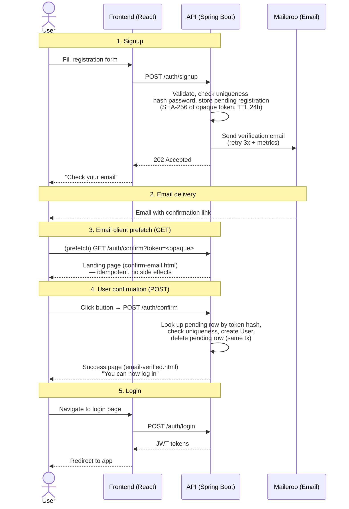

# Email Verification Decision

## Problem

When a user registers, we need to verify that the email address belongs to them before creating an account. This
prevents:

- Accounts created with someone else's email without consent
- Signup spam with fake/non-existent emails
- Email notifications going to an inbox the user doesn't control

## Decision: Double Opt-In (POST-based confirmation)

We chose **Double Opt-In** with a **POST-based confirmation** flow. The account is created only after the user clicks a
confirmation button on a landing page.

### Why POST and not GET?

Email clients and security gateways routinely follow GET links in emails as a security scanning measure. This is known
as **link prefetching** or **link protection**:

| Service                                              | Behavior                                                      | Risk Level |
|------------------------------------------------------|---------------------------------------------------------------|------------|
| **Gmail** (web + mobile)                             | Google Safe Browsing scans and may detonate links in emails   | HIGH       |
| **Microsoft 365 / Outlook**                          | Defender Safe Links proactively follows URLs at delivery time | HIGH       |
| **Enterprise gateways** (Proofpoint, Mimecast, etc.) | Routinely follow all links for threat analysis                | VERY HIGH  |

These services collectively cover >60% of consumer and business email. If the confirmation were a GET that creates the
user, the account would be activated before the human ever clicks — defeating the purpose of double opt-in.

We follow the industry-standard approach used by GitHub, Slack, and Stripe:

1. The email link (`GET /auth/confirm?token=...`) renders an idempotent landing page with a button
2. The human must click the button to issue a **POST** request, which performs the actual confirmation
3. Email clients never automatically submit forms or execute POST requests

### Alternative considered: Auto-submit via JavaScript (Hybrid)

A hybrid approach where the landing page auto-submits the form via JavaScript on page load was considered. This offers
1-click UX (like GET) with the security of POST. It was rejected because:

- The landing page + button approach is simpler, works without JS, and matches the existing `UnsubscribeController`
  pattern exactly
- The emotional reassurance of seeing a confirmation page with a deliberate button is valuable for account creation
- The existing project (unsubscribe) already demonstrates that a clean button-based flow works well

## Flow

## Token Structure

The verification token is an **opaque random token**: 32 bytes generated with a CSPRNG (`SecureRandom`), Base64URL-
encoded without padding (43 characters). It carries no user data — no password hash, no PII.

The pending registration lives server-side in the `pending_registrations` table:

| Column          | Value                                      |
|-----------------|--------------------------------------------|
| `username`      | Requested username                         |
| `email`         | Requested email                            |
| `password_hash` | BCrypt hash (strength 12)                  |
| `zone_info`     | IANA timezone string (validated at signup) |
| `token_hash`    | `SHA-256` (hex) of the opaque token        |
| `expires_at`    | `verification-token-expiration` (24h)      |

Only the SHA-256 of the token is stored: a database compromise does not yield usable tokens, and an intercepted email
yields no user data at all. Functional unique indexes on `LOWER(username)` and `LOWER(email)` mirror the `users`
constraints and resolve concurrent signups.

## Security Considerations

- **No sensitive data in the token**: The opaque token carries nothing decodable. The BCrypt hash never leaves the
  server — it moves from the signup request straight into `pending_registrations`.
- **Single-use**: The pending row is deleted in the same transaction that creates the user. Requesting signup again
  replaces the pending row, invalidating any previously emailed token.
- **Database compromise**: Token storage is hashed (SHA-256) — stolen rows cannot be turned into valid confirmation
  links.
- **Account enumeration**: Signup always returns the same generic message regardless of whether the email exists: *"Se
  ha enviado un email de verificación a ..."*
- **Rate limiting**: Signup (5 req/10s per IP) and Confirm (100 req/10s per IP) are rate-limited via Bucket4j.
- **Expired/invalid token**: Both the landing page (GET) and confirmation (POST) catch all exceptions and show a generic
  error message.

## Revision (2026-09): opaque token + pending_registrations replace JWT with embedded hash

The original design carried the BCrypt hash inside the verification JWT (only Base64-encoded, not encrypted) because
the account is not created until confirmation, so the hash had to "travel" in the token. This exposed the hash to
email interception and link-scanning gateways. The pending registration now lives server-side and the email carries
only an opaque random token, following the OWASP Forgot Password Cheat Sheet pattern (CSPRNG tokens, stored hashed,
single use).

Files modified in this revision:

- `db/migration/V1__initial_schema.sql` — new `pending_registrations` table (early-phase project: schema is reset and
  migrations edited in place, no V9 added)
- `db/migration/V2__add_unique_constraints.sql` — functional unique indexes `LOWER(username)` / `LOWER(email)`
- `db/migration/V7__enable_rls_on_tables.sql` — RLS enabled on the new table
- `entity/PendingRegistration.java` (new), `repo/PendingRegistrationRepository.java` (new)
- `service/PendingRegistrationService.java` (new) — token generation, lookup, lifecycle
- `service/JwtService.java` — verification token generation/extraction removed
- `service/AuthService.java` — `signup()` stores the pending registration
- `service/VerificationService.java` — consumes the pending row instead of JWT claims
- `util/TokenType.java` — `VERIFY_EMAIL` constant removed

## Files Modified/Created

### New files (6 source + 1 doc)

- `service/VerificationService.java`
- `controller/verification/EmailVerificationController.java`
- `exception/domain/InvalidEmailVerificationException.java`
- `dto/response/SignupResponse.java`
- `templates/confirm-email.html`
- `templates/email-verified.html`
- `templates/email/email-verification.html`
- `doc/email-verification-decision.md`

### Modified files (7)

- `util/TokenType.java` — added `VERIFY_EMAIL`
- `service/JwtService.java` — added verification token generation + extraction
- `service/AuthService.java` — replaced `register()` with `signup()`
- `service/notification/EmailService.java` — added `sendVerificationEmail()`
- `controller/auth/AuthController.java` — replaced `/register` with `/signup`
- `config/RateLimitingConfig.java` — added `signup` and `confirm` endpoint configs
- `application.yaml` — added `verification-token-expiration` and rate limits
