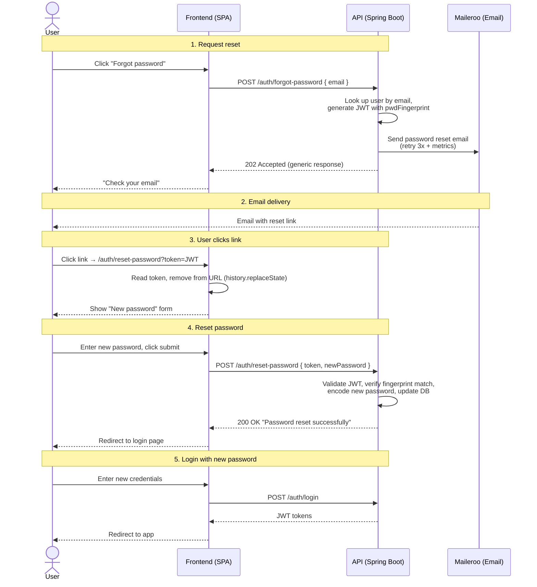

# Password Recovery Decision

## Problem

When a user forgets their password, they need a secure, self-service mechanism to regain access to their account. This
prevents:

- Locked-out users requiring manual administrative intervention
- Users creating duplicate accounts after losing access
- Support burden from password reset requests
- Security risks from weak or shared recovery methods (e.g., security questions)

## Decision: JWT-based Stateless Reset with Fingerprint Validation

We chose a **stateless JWT-based password reset** where the reset token contains a keyed fingerprint
(`pwdFingerprint` = `HMAC-SHA256(PWD_FINGERPRINT_SECRET, passwordHash)`) of the current password hash. The account
password is updated only after verifying that the token fingerprint matches the fingerprint of the stored hash.

### Why stateless JWT and not a DB-stored token?

- **No new table**: The token is self-contained (JWT), eliminating the need for a `password_reset_tokens` table and a
  Flyway migration.
- **Architectural split**: The signup flow stores pending registrations server-side (pre-account state must live in the
  database), while reset stays stateless because the user row already exists to validate against.
- **Auto-invalidation on password change**: When the password is updated, the hash changes. Any existing reset token
  becomes automatically invalid because the fingerprint of the stored hash no longer matches.
- **No pending state to clean up**: Expired tokens don't accumulate in the database.

### Why frontend-based UI and not Thymeleaf (like email verification)?

- **Consistency**: The existing app UI is a frontend SPA. Mixing Thymeleaf pages for password reset creates a disjointed
  user experience.
- **Separation of concerns**: The API remains a pure JSON API; the frontend owns the UI layer.
- **Flexibility**: The frontend can implement show/hide password, strength indicators, and error handling within its own
  component library.

### Alternative considered: Thymeleaf-based flow (rejected)

A flow identical to email verification (GET renders a form, POST processes it) was rejected because:

- The email verification flow uses Thymeleaf because it's the user's **first interaction** with the app (pre-account).
- Password reset users are **existing users** who should return to the familiar frontend experience.
- Maintaining two UI rendering strategies (`@Controller` for reset + SPA) adds unnecessary complexity.

## Flow

## JWT Structure

The reset token (`TokenType.PASSWORD_RESET`) is a JWT signed with HMAC-SHA256 (same key as access/refresh tokens):

| Claim            | Value                                                      |
|------------------|------------------------------------------------------------|
| `tokenType`      | `"PASSWORD_RESET"`                                         |
| `sub`            | `userId` (Long)                                            |
| `pwdFingerprint` | `Base64(HMAC-SHA256(PWD_FINGERPRINT_SECRET, bcrypt hash))` |
| `exp`            | 15 min from issuance                                       |
| `iat`            | Issuance timestamp                                         |

The `pwdFingerprint` is a **keyed one-way digest** of the BCrypt hash: the hash is an *input* to the HMAC computation
(same approach as Django's `PasswordResetTokenGenerator`), never part of the token payload. Validation recomputes the
HMAC of the stored hash and compares both values in constant time (`MessageDigest.isEqual`). When the password
changes, the BCrypt hash (and therefore its fingerprint) changes, invalidating every outstanding token.

`PWD_FINGERPRINT_SECRET` is a dedicated secret (Base64, >= 32 bytes decoded), separate from `JWT_SECRET_KEY`, so
compromising the JWT signing key alone does not allow forging valid fingerprints.

## Security Considerations

- **Password fingerprint in JWT (not the hash)**: The token payload only contains a keyed HMAC digest of the BCrypt
  hash. An attacker who intercepts the email or the link cannot recover the hash and cannot verify offline password
  guesses without `PWD_FINGERPRINT_SECRET`. Rotating that secret invalidates all outstanding tokens (users simply
  request a new one). Comparison is constant-time to prevent timing oracles.
- **User enumeration**: `forgot-password` always returns HTTP 202 with the same message regardless of whether the email
  exists: *"If an account with that email exists, a password reset link has been sent."*
- **Auto-invalidation on password change**: If the user or an attacker changes the password using any token, all other
  tokens become invalid because the stored hash (and its fingerprint) no longer matches.
- **Rate limiting**: `forgot-password` (3 requests / 10 min per IP) and `reset-password` (5 requests / min per IP) are
  rate-limited via Bucket4j.
- **Token in URL query parameter**: The reset token is present in the URL when the user clicks the email link. Best
  practice requires the frontend to remove the token from the URL using `history.replaceState()` immediately after
  reading it.
- **No refresh token invalidation**: Resetting the password does not invalidate existing refresh tokens. This is
  intentional — the user is recovering their own account, not responding to a compromise. A dedicated "log out of all
  devices" feature would handle that separately.
- **Expired/invalid token**: Both `isResetPasswordToken()` and `extractResetPasswordData()` catch all exceptions and
  return a generic error: *"The reset link is invalid or has expired. Please request a new one."*

## Revision (2026-09): fingerprint replaces raw hash in token

The original design embedded the BCrypt hash in the `passwordHash` claim. Since JWT payloads are only Base64-encoded
(not encrypted), anyone intercepting the email (or link-scanning email gateways) could decode the hash and attack it
offline. The claim was replaced with `pwdFingerprint` (keyed HMAC digest), following the pattern of Django's
`PasswordResetTokenGenerator` and the OWASP Forgot Password Cheat Sheet guidance against embedding sensitive material
in tokens.

Files modified in this revision:

- `service/JwtService.java` — reset token carries `pwdFingerprint`; `email` and `passwordHash` claims removed
- `service/PasswordFingerprintService.java` (new) — HMAC-SHA256 computation + constant-time matching
- `service/AuthService.java` — `forgotPassword()` / `resetPassword()` use the fingerprint service
- `config/properties/ApplicationProperties.java`, `application.yaml`, `.env.example` — `PWD_FINGERPRINT_SECRET`

## Files Modified/Created

### New files (6 source + 1 doc)

- `dto/request/ForgotPasswordRequest.java`
- `dto/request/ResetPasswordRequest.java`
- `dto/response/ForgotPasswordResponse.java`
- `dto/response/ResetPasswordResponse.java`
- `exception/domain/InvalidResetPasswordTokenException.java`
- `templates/email/password-reset.html`
- `doc/password-recovery-decision.md`

### Modified files (7)

- `util/TokenType.java` — added `PASSWORD_RESET`
- `service/JwtService.java` — added `generatePasswordResetToken()`, `extractResetPasswordData()`,
  `isResetPasswordToken()`
- `service/AuthService.java` — added `forgotPassword()` and `resetPassword()`
- `controller/auth/AuthController.java` — added `POST /auth/forgot-password` and `POST /auth/reset-password`
- `service/notification/EmailService.java` — added `sendPasswordResetEmail()`
- `config/RateLimitingConfig.java` — added `forgotPassword` and `resetPassword` endpoint configs
- `application.yaml` — added `reset-token-expiration: 900000` and rate limits
